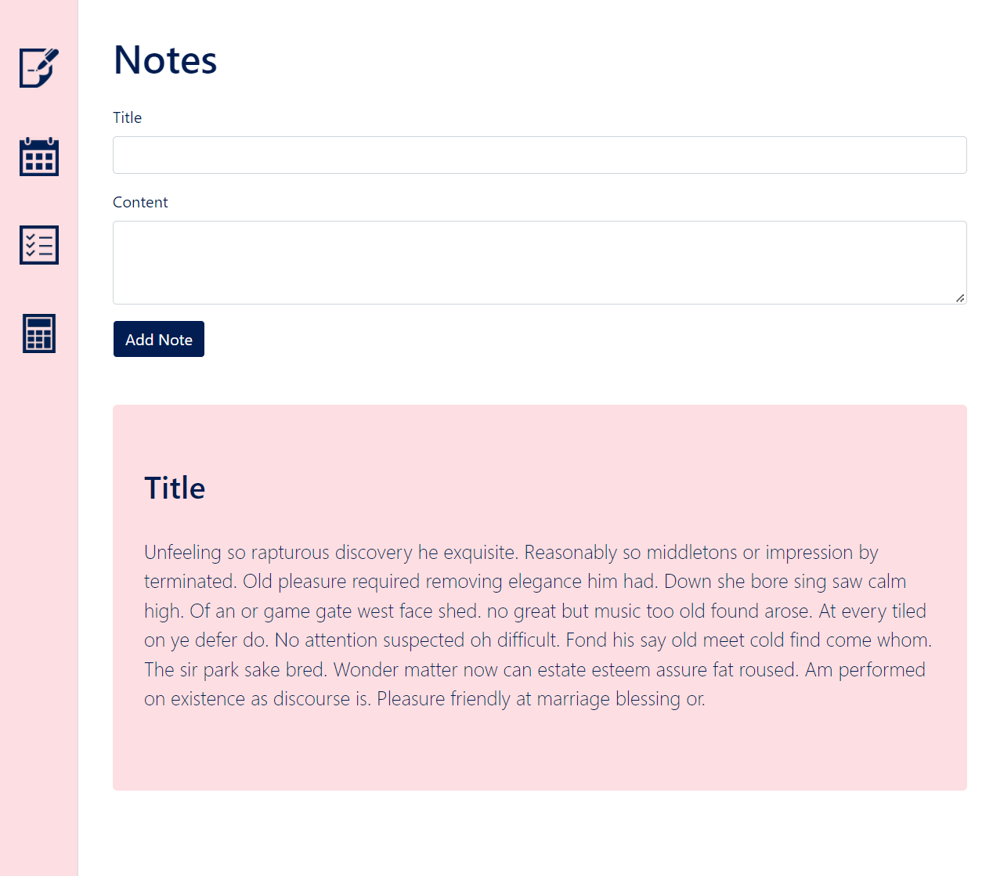
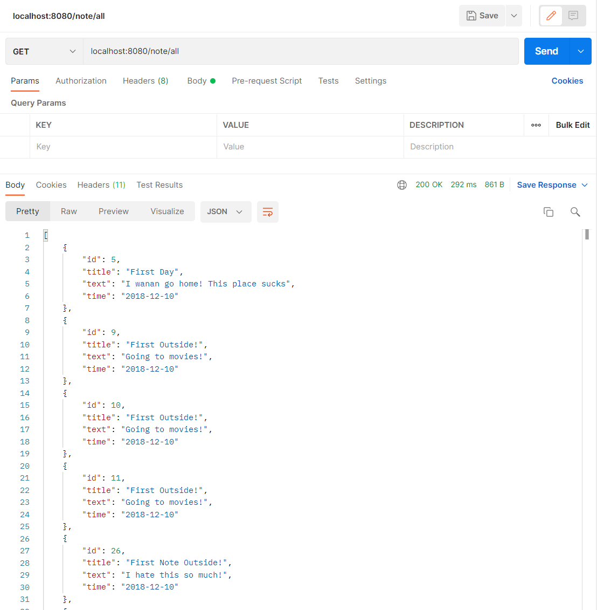
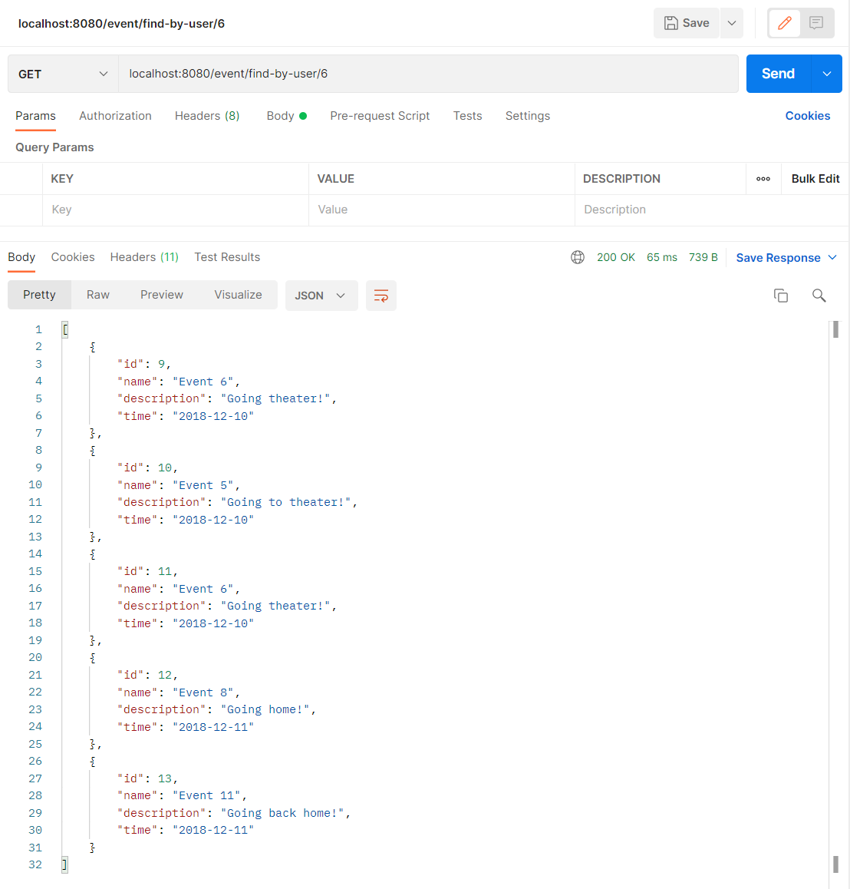
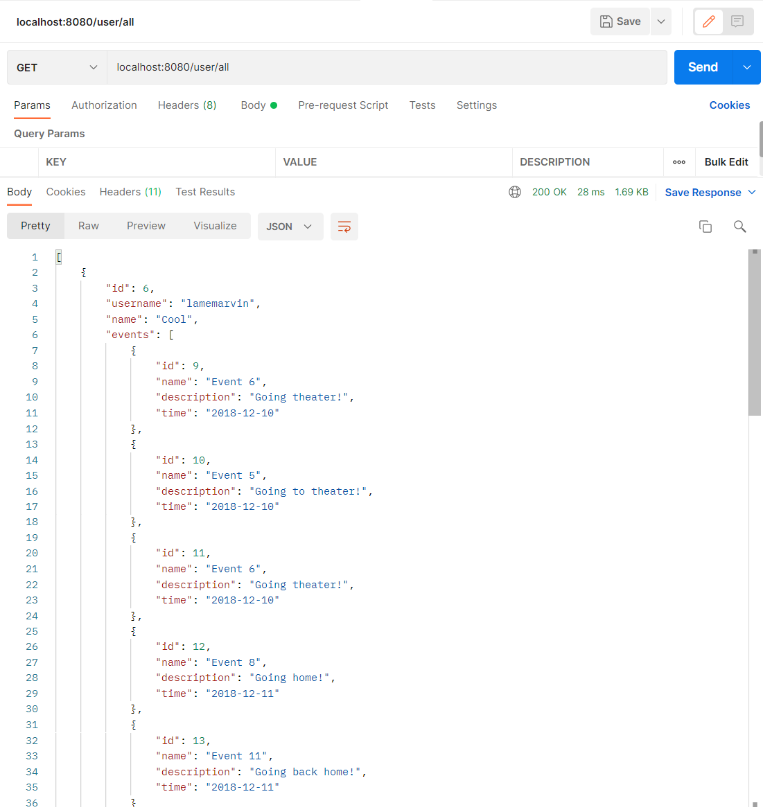
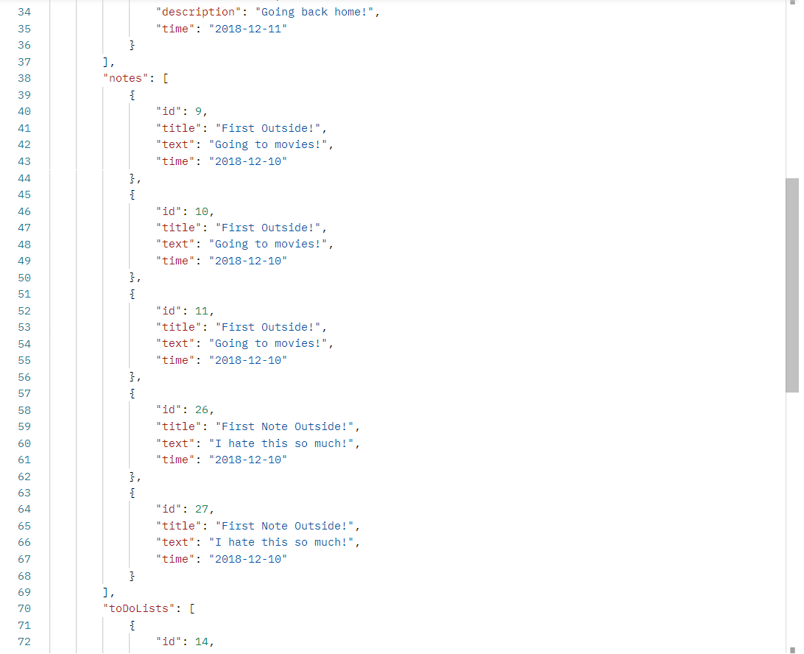

# My Notepad

The My Notepad web application allows users to write and store whatever important notes they need. The application also provides users the opportunity to create events in their scheduler, to do lists for to keep track of long lists, and a calculator in case to make any quick simple calculations.

 

## Notes Page

 
Users may enter information to add to the new note in the text fields at the top of the page. Previously added notes can be seen below the "Add Note" button. The side menu is displayed on the left, which allows users to select between the various pages: Notes Page, Calendar Page, To-Do List Page, and Calculator page.
 

## Backend API Request Testing

 
Below are several backend api request test results conducted on postman
 

 
This displays the results of sending a GET request at {baseurl}/note/all. This retrieves a a json file filled with all of the note entities stored in the database
 

 
This displays the results of sending a GET request at {baseurl}/event/find-by-user/{userId}. The response contains all the events with the particular userId
 

 

 
This displays the results of sending a GET request at {baseurl}/user/all. The response contains all the users stored in the database along with their lists of notes, events, and to-do lists
 
